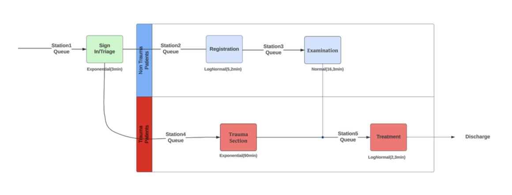
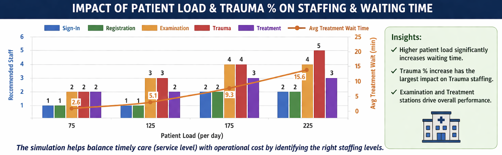

# Healthcare Clinic Staffing Simulation

This project analyzes staffing requirements for a walk-in healthcare clinic using discrete-event simulation in Excel VBA / VBASim.

The goal was to estimate staffing levels needed to meet service requirements across different patient-load and trauma scenarios while balancing operational efficiency and cost-effectiveness.

---

## Project Overview

The clinic consists of five stations:

- Sign-In / Triage
- Registration
- Examination
- Trauma
- Treatment

Patients first enter Sign-In / Triage and are then routed based on severity:

- **Trauma patients** go to Trauma, then Treatment
- **Non-trauma patients** go to Registration, then Examination, and then Treatment if needed

The project evaluates staffing decisions under different combinations of:

- patient load: **75 to 225 patients per day**
- trauma share: **8% to 12%**
- service-level requirements emphasizing rapid stabilization for trauma patients

---

## Simulation Approach

I developed a discrete-event simulation model in **Microsoft Excel using VBASim / VBA**.

Key modeling elements include:

- patient arrivals modeled as a **Poisson process**
- station-specific service-time distributions
- FIFO queueing at each station
- 1,000 simulation replications per scenario
- confidence interval estimates for average waiting times

### Patient Flow Structure

### Input Modeling

The main model uses the following service-time assumptions:

- **Sign-In / Triage:** Exponential, mean 3 minutes
- **Registration:** Lognormal, mean 5, variance 2
- **Examination:** Normal, mean 16, variance 3
- **Trauma:** Exponential, mean 90
- **Treatment (trauma patients):** Lognormal, mean 30, variance 4
- **Treatment (non-trauma patients):** Lognormal, mean 13.3, variance 2

---

## Key Results

The simulation produced staffing recommendations across multiple demand scenarios.

### Light-load scenario
For **75 patients/day** with **8% trauma**, the recommended staffing policy was:

- Sign-In: 1
- Registration: 1
- Examination: 2
- Trauma: 2
- Treatment: 2

### Heavy-load scenario
For **225 patients/day** with **12% trauma**, the recommended staffing policy was:

- Sign-In: 2
- Registration: 2
- Examination: 4
- Trauma: 5
- Treatment: 3

### Additional Insight
At the same patient load, moving from **8% trauma to 12% trauma** primarily increased staffing need at the **Trauma station**, while other station staffing stayed the same.

### Results Snapshot

The analysis also explored the trade-off between service quality and staffing cost. For example, in the heaviest-load case, reducing Sign-In staffing could still keep waiting time relatively low, but it would no longer meet the desired “very fast” experience. Reducing Examination staffing had a much larger impact on waiting time.

---

## Extension: Nonstationary Arrival Case

As an additional extension, the project also examined an **NSPP arrival case** and evaluated how staffing policies affect system performance under more variable arrival patterns.

One of the main lessons from this analysis was that the clinic flow is highly interdependent, so changing staffing at one station also affects waiting times at upstream and downstream stations.

---

## Files in This Repository

- `VBASimTClinicProject.xlsm` – Excel/VBASim simulation model
- `Sim_WA_Part1_AS.pdf` – main report for the current-system analysis
- `Sim_WA_Part2_AS.pdf` – supplementary report including the NSPP arrival case

---

## Tools and Skills Used

- Excel VBA
- VBASim
- Discrete-Event Simulation
- Queueing Analysis
- Confidence Intervals
- Scenario Analysis
- Healthcare Operations Modeling

---

## Why This Project Matters

This project shows how simulation can support operational decision-making in healthcare systems.

It demonstrates how to:

- model patient flow through a multi-stage service system
- evaluate staffing policies under demand uncertainty
- quantify service-level trade-offs using simulation output
- translate model results into practical staffing recommendations

The same kind of thinking applies to healthcare operations, service systems, workforce planning, and process improvement roles.

---

## Author

**Ashutosh Srivastava**  
M.S. in Industrial & Systems Engineering  
Virginia Tech

---

## Notes

This project is shared as a portfolio example of simulation-based decision support and staffing analysis.
